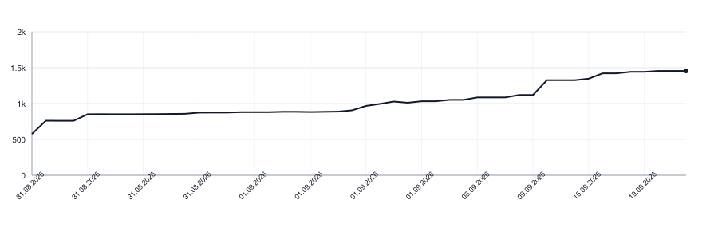

# commentcensor

[](https://github.com/botforge-pro/commentcensor/actions/workflows/check.yml)

Every comment in your code is an error until you write down why it cannot
be avoided.

[Read the manifesto.](MANIFESTO.md)

```
$ commentcensor src/
src/store.py:41: comment
    # retry three times before giving up
src/parser.go:87: comment
    // the server sends the fields out of order

2 comments not declared in .commentcensor.yaml
```

## What it does

Parses the file, finds every comment the grammar reports, and fails on
each one that is not declared in `.commentcensor.yaml` with a reason.
Exit code is 1 when the code and the declarations disagree either way, so
it belongs in CI beside the formatter.

These are not comments in that sense and pass without being declared:
instructions to a tool (`# noqa`, `# type: ignore`, `//go:embed`,
`// swiftlint:disable`, `@ts-expect-error`), a shebang, a section marker
(`// MARK:`, `# region`), and a comment in the first five lines containing
`SPDX-License-Identifier`, `Copyright` or `Licensed under`.

Walking a directory ignores dot-directories. Pass a file explicitly if
you want to check one inside a dot-directory.

## Languages

Python, Go, SQL, Swift, Kotlin, TypeScript, JavaScript. Parsed with
tree-sitter, so a `#` inside a string or a `//` inside a URL is not
mistaken for a comment.

Python docstrings count. A docstring that repeats the name of the
function under it is the thing this tool exists to remove, and it stays a
finding whether or not the project publishes a reference: the exemption
covers a public name, not every string under a `def`.

## Configuration

Three knobs.

```yaml
# .commentcensor.yaml
documentation: https://pkg.go.dev/example.com/thing

skip:
  - Generated/
  - vendor/

allow:
  - file: src/store.py
    text: "# retry three times before giving up"
    what_was_tried_and_why_none_of_it_worked:
      "A name says three, not why three: the provider drops the first
       request of a cold connection, and nothing in the code can say so."
```

`documentation` is the address where this project's reference is published.
With it, a comment the language's own generator publishes needs no entry of
its own: a docstring of a public name, a Go doc comment on an exported
declaration. Such a comment is not a second source of truth, because the
reference is built from it. A comment anywhere else is still a comment.

The address is read rather than believed. The page must name something the
exempted comments document, so one that leads nowhere, or to somebody else's
page, fails the run. It is kept under `$XDG_CACHE_HOME` for a week, so the
check costs one request and then nothing.

`skip` takes whole paths out of the check: generated code, vendored
code, a directory you have not got to yet.

`allow` names one comment and records the alternatives tried before keeping
it. The field is long on purpose: it asks which replacement was attempted,
such as a name, extracted function, runtime log, test, issue or project
documentation, and what each could not express, enforce or preserve. A reason
that only restates the comment shows that no replacement was tried.

commentcensor verifies that a declaration exists and still matches the
comment. Code review decides whether its argument is true and meets one of
the permitted exceptions.

An entry is matched by the comment's own text, not by its line, so
moving the code keeps the exception and editing the comment loses it —
an argument that was made for one sentence does not carry over to
another.

An entry that matches nothing is a finding of its own: it claims a
comment is in a file, and the claim is false once the comment is edited,
moved to another file or deleted. Only entries naming files inside the
run are checked this way, so checking one directory says nothing about
the entries for another.

The nearest `.commentcensor.yaml` above a file is the one that applies,
and its `skip` and `allow` add to those of the configs above it.

There is no mode that takes an existing repository as it stands. A
codebase adopts this by fixing its comments or by listing its paths in
`skip` until it does.

## Lines of Code

<picture>
  <source media="(prefers-color-scheme: dark)" srcset=".github/loc-history-dark.svg">
  <source media="(prefers-color-scheme: light)" srcset=".github/loc-history-light.svg">
  
</picture>

## Installing

Requires Python 3.11 or newer. Until the package is published on PyPI,
install it directly from GitHub:

```
python -m pip install git+https://github.com/botforge-pro/commentcensor.git
```
